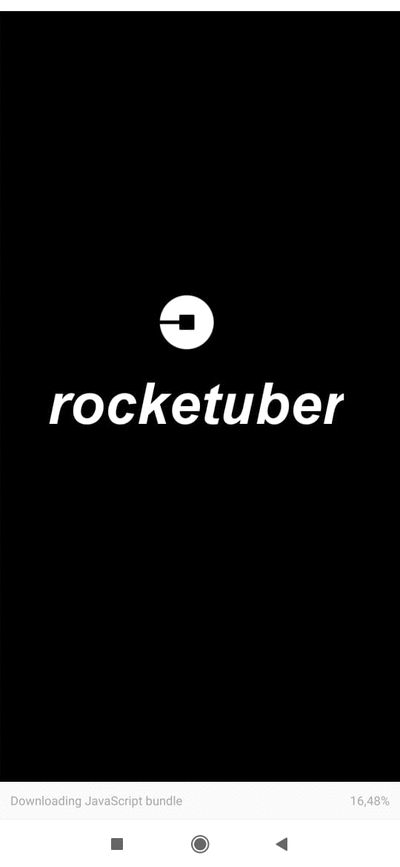

<h1 align="center">
    RocketUber
</h1>

 

  

## :rocket: Tecnologias

Esse projeto foi desenvolvido com as seguintes tecnologias:

- [React Native](https://facebook.github.io/react-native/)
- [Expo](https://expo.io/)
- [API de Geolocalização e Rotas do Google Maps](https://cloud.google.com/maps-platform?hl=pt-br)

## 💻 Projeto

Interface do passageiro do aplicativo Uber em React Native projeto criado pela Rocketseat atualizado para as novas práticas utilizando o Expo. 

 #ReactNative #Uber
